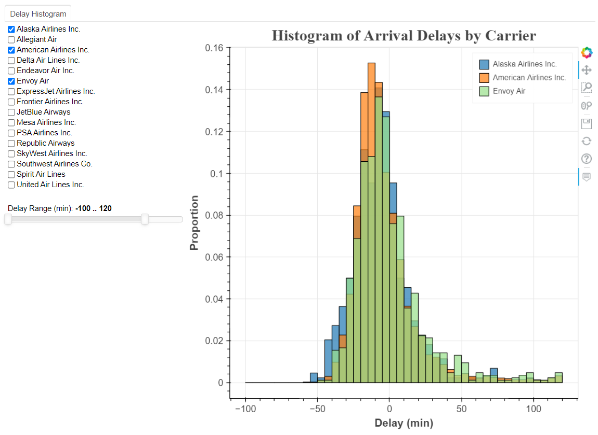
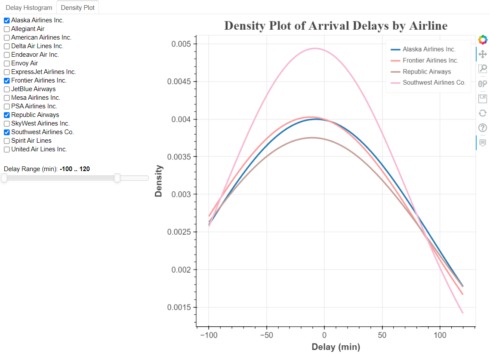

**2020 Houston Flights Delay Dashborad**

In this repo, I visualized flights delay with `Bokeh`.

**Contents:**
- [1. Introduction](#1-introduction)
- [2. Preview of final results](#2-preview-of-final-results)
- [3. Bokeh_serve_demo](#3-bokeh_serve_demo)
- [4. Bokeh_standalon_JS_demo](#4-bokeh_standalon_js_demo)

## 1. Introduction
According to Bokeh's introduction on [widgets](https://docs.bokeh.org/en/latest/docs/user_guide/interaction/widgets.html):

There are two ways to use a widget’s functionality:

- A `CustomJS` callback. This approach will work in standalone HTML documents or Bokeh server apps, need `JavaScript` programming.

- Use `bokeh serve` to start a Bokeh server and set up event handlers with `.on_change` (or for some widgets, `.on_click`), pure `Python` programming.

## 2. Preview of final results

<p float="left">
  
  
  
  
  
</p>

## 3. Bokeh_serve_demo

Implemented `bokeh serve` method. Check the **blog** [here](https://ycheng22.github.io/Deploy_Bokeh_Server_App_on_Heroku/).

This demo is deployed on `Heroku`, check it here <https://yc-bokeh-server2.herokuapp.com/>

```
📦Bokeh_serve_demo
 ┣ 📂data
 ┃ ┣ 📜arr_delay.csv
 ┃ ┗ 📜Hou_flights.csv
 ┣ 📂scripts
 ┃ ┣ 📂__pycache__
 ┃ ┣ 📜density.py
 ┃ ┣ 📜draw_map.py
 ┃ ┣ 📜histogram.py
 ┃ ┣ 📜routes.py
 ┃ ┣ 📜table.py
 ┃ ┗ 📜__init__.py
 ┣ 📜main.py
 ┣ 📜Procfile
 ┣ 📜requirements.txt
 ┗ 📜runtime.txt
```

- `main.py` are the main function to build final map.
- `scripts` has the subroutines which were called in `main.py`.
- Check the blog to know how to deploy it on Heroku.

## 4. Bokeh_standalon_JS_demo

Implemented `CustomJS` method. Check the **blog** [here](https://ycheng22.github.io/2020_Houston_flights_delay_dashboard/).

```
📦Bokeh_standalon_JS_demo
 ┣ 📂data
 ┃ ┣ 📜airlines_code.xlsx
 ┃ ┣ 📜airports.csv
 ┃ ┣ 📜arr_delay.csv
 ┃ ┣ 📜Hou_flights.csv
 ┃ ┗ 📜Hou_flights_location.csv
 ┣ 📜all_plot.html
 ┣ 📜Bokeh_standalon_JS.ipynb
 ┣ 📜Data_Processing_part1.ipynb
 ┣ 📜Data_Processing_part2.ipynb
 ┣ 📜flight_map.html
 ┣ 📜histogram.html
 ┗ 📜Hou_flights_delay_plots.html
```
- `Data_Processing_part1.ipynb` and `Data_Processing_part1.ipynb` are the code processed the data
- `Bokeh_standalon_JS.ipynb` is the code about visualization, all output are `html` file, which can be embeded in webpage easily.
- `.html` files are some outputs.
